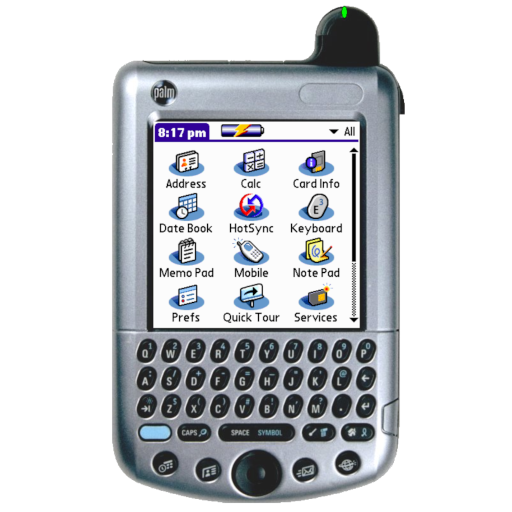

# Palm OS (Mu)

### Description

Mu is a new Palm OS emulator targeting compatibility, speed and accuracy in that order.

Note: The BIOS files *palmos41-en-m515.rom* and *palmos52-en-t3.rom* are needed.

### License

CC BY-NC 3.0 US (Non-commercial)

### Icon

### Fanart

Help make me fanart!

### Screenshots

Help make me screenshots!
